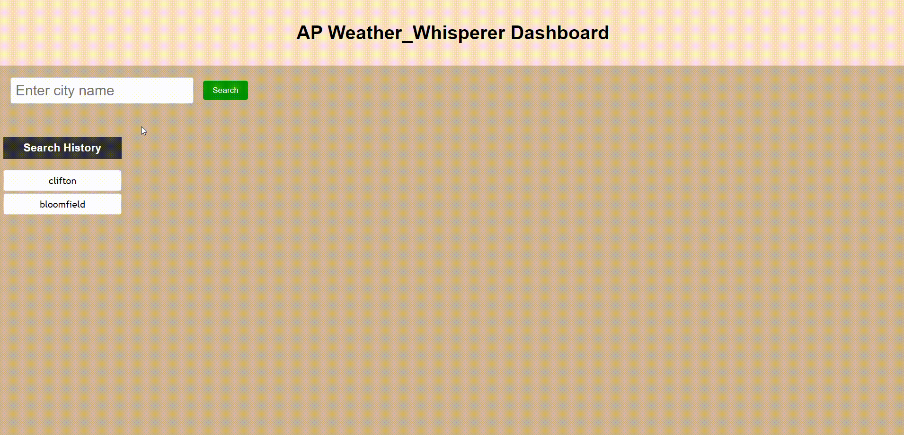

# AP_Weather_Whisperer

## Description 
This website is a  weather dashboard . That allows users to search for weather information for different cities.  view the current weather as well as a 5-day forecast and saved a search history.  

## Table of Contents

- [AP\_Weather\_Whisperer](#ap_weather_whisperer)
  - [Description](#description)
  - [Table of Contents](#table-of-contents)
  - [Technology used](#technology-used)
  - [Features](#features)
  - [Installation](#installation)
  - [Usage](#usage)
  - [Credits](#credits)
  - [view concept](#view-concept)
  - [License](#license)

## Technology used 

* Html 
* CSS
* JavaScript
* Openweather API for whether data 
  
  
## Features 
* Users can Search for weather information by entering a city name.
* Its Display the current weather conditions including temperature, humidity, and wind speed by city search.
* Display a 5-day forecast showing temperature, humidity, and wind speed trends.
* Access a search history list that records your previous city searches.
* Click on a city in the search history to automatically  retrieve its weather information.

## Installation

For doing this challenges , first i install the VS Code developer tool to edit and modify the starter code. 

## Usage

1. clone the AP_Weather_Whisperer repository to your local machine.
2. Open the "index.html" file in your browser. 
3. Enter the name of a city in the search input and click the "Search" button to get weather information
4. The current weather details and a 5-day forecast will be displayed.
5. here is demo of app : 

## Credits
* i clone a starter code from this repository: [https://github.com/coding-boot-camp/crispy-octo-meme]

* i watched this video for push the code from vs code to git hub and deployed at live .[https://www.youtube.com/watch?v=Ky_aUrzArt4]

* In this website , its very helpful to understand how to make a javascript click event listener .[https://developer.mozilla.org/en-US/docs/Web/API/Element/click_event]

*  In this website, i learned a then method.[https://developer.mozilla.org/en-US/docs/Web/JavaScript/Reference/Global_Objects/Promise/then] 

* in this website, i learned a how to fetch the data.[https://developer.mozilla.org/en-US/docs/Web/API/Fetch_API/Using_Fetch] 
 * The weather data is fetched from the OpenWeatherMap API. [https://openweathermap.org/forecast5]
 * i learned from here, how to formatted the date in numeric format [https://stackoverflow.com/questions/27939773/tolocaledatestring-short-format]

 ## view concept 
 
 Deployed the application from here:[https://anandp95.github.io/AP_Weather_Whisperer/]
 
## License
N/A